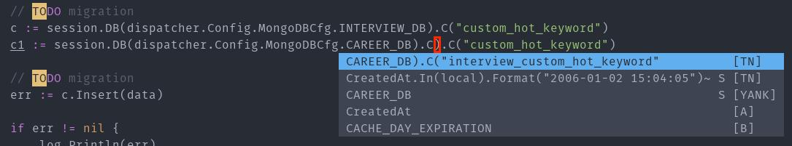

原本對 [TabNine](https://tabnine.com/) 是持保留態度，好像沒有也沒差…

<!--more-->

今天在做手工的時候終於發現它的好處了…

如圖，TabNine 已經學習到我今天的做的事了… (自動幫我加上 prefix)

雖然是免費版的，但也讓我少做了不少手工！超爽的！

推薦給各位我使用的 Vim plugins: [coc.nvim](https://github.com/neoclide/coc.nvim)、[coc-tabnine](https://github.com/neoclide/coc-tabnine)。

---

在 TabNine 網站上申請了 [TabNine Beta 試用](https://tabnine.com/beta_signup)，馬上就收到試用的邀請！

原本一直在 Vim command 裡面找 TabNine::config，試了老久都找不到…

後來才發現要直接打在內容裡… XD 打完就會跳出輸入 token 的頁面了！(果然是很 AI)
